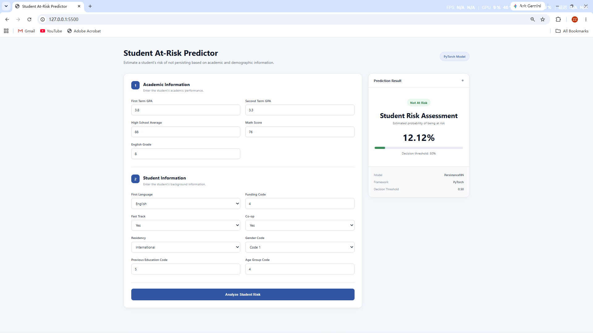
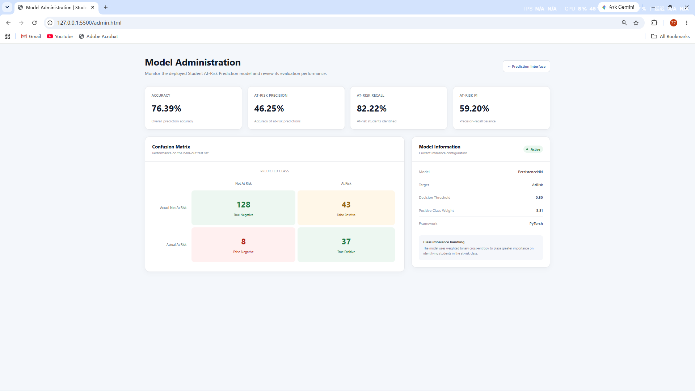

# Student At-Risk Prediction System

## Overview

This project is a machine learning system that predicts whether a student is at risk of not persisting in their studies.

It uses PyTorch to train a neural network model based on students' academic and demographic information.

The backend is built with FastAPI and provides REST API endpoints for model inference, health checks, and model performance information.

A web-based prediction interface allows users to enter student information and view the predicted at-risk probability. A separate administration dashboard displays model performance metrics and evaluation results.

## Features

* Student at-risk prediction
* Automated data preprocessing
* Class imbalance handling
* Neural network training with early stopping
* Model evaluation using multiple metrics
* REST API for model inference
* Web-based prediction interface
* Model administration dashboard
* Risk probability visualization
* Confusion matrix visualization

## Tech Stack

* Python
* PyTorch
* FastAPI
* Scikit-learn
* Pandas
* NumPy
* HTML / CSS / JavaScript

## Project Structure

```text
Student At-Risk Prediction System/
│
├── backend/
│   ├── data/
│   │   ├── data_loader.py              # Loads the student dataset
│   │   └── preprocessing.py            # Cleans and preprocesses data
│   │
│   ├── model/
│   │   ├── network.py                  # Defines the PyTorch neural network
│   │   └── train.py                    # Trains and evaluates the model
│   │
│   ├── artifacts/
│   │   ├── model.pt                    # Trained model weights
│   │   ├── preprocessor.pkl            # Fitted preprocessing pipeline
│   │   └── metrics.pkl                 # Saved test metrics
│   │
│   ├── main.py                         # FastAPI application
│   └── predictor.py                    # Loads artifacts and performs inference
│
├── frontend/
│   ├── index.html                      # Student prediction interface
│   ├── admin.html                      # Model administration dashboard
│   ├── style.css                       # Frontend styling
│   └── script.js                       # API requests and prediction display
│
├── .gitignore
├── README.md
├── pyproject.toml
└── requirements.txt
```

## Machine Learning Pipeline

1. **Data Loading**

   * Load the student dataset.

2. **Data Preprocessing**

   * Handle missing values.
   * Scale numerical features.
   * Encode categorical features.

3. **Data Splitting**

   * Split the dataset into training, validation, and test sets.

4. **Model Training**

   * Train a PyTorch neural network using weighted binary cross-entropy loss.
   * Apply early stopping based on validation loss.

5. **Model Evaluation**

   * Evaluate the final model using accuracy, precision, recall, F1-score, and a confusion matrix.

6. **Model Saving**

   * Save the trained model weights, fitted preprocessing pipeline, and evaluation metrics for inference.

## Model Performance

The final model was evaluated on a held-out test set.

### Test Metrics

| Metric            |  Score |
| ----------------- | -----: |
| Accuracy          | 76.39% |
| At-Risk Precision | 46.25% |
| At-Risk Recall    | 82.22% |
| At-Risk F1-Score  | 59.20% |

### Confusion Matrix

|                    | Predicted Not At Risk | Predicted At Risk |
| ------------------ | --------------------: | ----------------: |
| Actual Not At Risk |                   128 |                43 |
| Actual At Risk     |                     8 |                37 |

The model uses a weighted loss function to address class imbalance and place greater importance on identifying students in the at-risk class.

## Web Interface

### Student Prediction Interface

The prediction interface allows users to enter academic and demographic information and receive:

* At-risk classification
* At-risk probability
* Visual probability indicator
* Model decision threshold

### Model Administration Dashboard

The administration dashboard provides an overview of the deployed model, including:

* Accuracy
* At-risk precision
* At-risk recall
* At-risk F1-score
* Confusion matrix
* Decision threshold
* Positive class weight
* Model and framework information

## Screenshots

### Prediction Interface



### Model Administration Dashboard



## Categorical Feature Codes

Some categorical features are represented using the original dataset codes because descriptive mappings for these categories were not provided with the dataset.

These coded features are therefore preserved rather than assigning unsupported category descriptions.

## Installation

1. Clone the repository.

2. Create and activate a virtual environment.

3. Install the dependencies:

```bash
pip install -r requirements.txt
```

## Running

### Backend

Start the FastAPI backend from the project root:

```bash
python -m uvicorn backend.main:app --reload
```

The API will run at:

```text
http://127.0.0.1:8000
```

FastAPI documentation is available at:

```text
http://127.0.0.1:8000/docs
```

### Frontend

Open another terminal and run:

```bash
python -m http.server 5500 --directory frontend
```

Then open the prediction interface at:

```text
http://127.0.0.1:5500
```

The model administration dashboard is available at:

```text
http://127.0.0.1:5500/admin.html
```

## API Endpoints

| Method | Endpoint      | Description                                       |
| ------ | ------------- | ------------------------------------------------- |
| GET    | `/health`     | Check API status                                  |
| POST   | `/predict`    | Predict student at-risk probability               |
| GET    | `/model-info` | Retrieve model information and evaluation metrics |